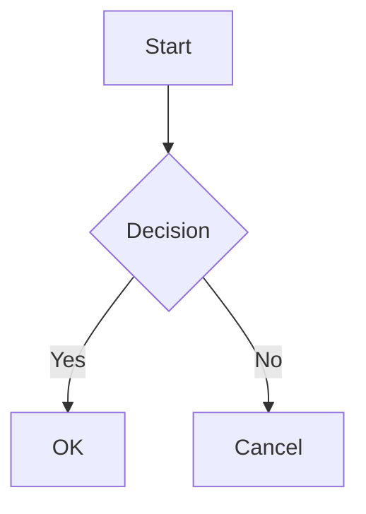
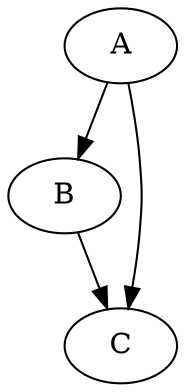

# Confluence Markdown Chart Macro

A Confluence 6.7 plugin that provides a macro for rendering **Markdown** content with embedded **Mermaid** and **Graphviz (DOT)** diagrams — all rendered client-side in the browser.

## Architecture

```
User writes Markdown in macro body
        │
        ▼
  Java backend (MarkdownMacro.java)
  → escapes HTML, wraps in <div>
        │
        ▼
  Browser loads page
        │
        ▼
  markdown-macro.js
  ├─ extracts fenced code blocks (```mermaid / ```graphviz / ```dot)
  ├─ renders Markdown → HTML  (marked.js)
  ├─ renders Mermaid → SVG    (mermaid.js)
  └─ renders Graphviz → SVG   (viz.js)
```

## Project Structure

```
my-markdown-macro/
├── pom.xml                              # Atlassian Plugin SDK configuration
├── src/
│   ├── main/
│   │   ├── java/com/example/
│   │   │   └── MarkdownMacro.java       # Macro backend class
│   │   └── resources/
│   │       ├── atlassian-plugin.xml     # Plugin descriptor
│   │       ├── js/
│   │       │   ├── markdown-macro.js    # Frontend rendering logic
│   │       │   ├── marked.min.js        # Markdown parser (placeholder)
│   │       │   ├── mermaid.min.js       # Mermaid renderer (placeholder)
│   │       │   └── viz.js               # Graphviz WASM renderer (placeholder)
│   │       └── css/
│   │           └── markdown-macro.css   # Styles
│   └── test/java/com/example/
│       └── MarkdownMacroTest.java       # Unit tests
└── README.md
```

## Prerequisites

| Tool | Version |
|------|---------|
| JDK | 1.8+ |
| Atlassian Plugin SDK | 6.3.x |
| Maven | 3.5+ |

## Setup

### 1. Install third-party JavaScript libraries

The `src/main/resources/js/` directory contains **placeholder** files for the three required libraries. Replace them with the real minified bundles:

| File | Library | Recommended Version | Download |
|------|---------|---------------------|----------|
| `marked.min.js` | [marked](https://github.com/markedjs/marked) | 4.3.0 | [CDN](https://cdn.jsdelivr.net/npm/marked@4.3.0/marked.min.js) |
| `mermaid.min.js` | [mermaid](https://github.com/mermaid-js/mermaid) | 9.4.3 | [CDN](https://cdn.jsdelivr.net/npm/mermaid@9.4.3/dist/mermaid.min.js) |
| `viz.js` | [viz.js](https://github.com/nicknisi/viz.js) | 2.1.2 | [unpkg](https://unpkg.com/viz.js@2.1.2/viz.js) + [full.render.js](https://unpkg.com/viz.js@2.1.2/full.render.js) |

### 2. Build

```bash
atlas-mvn package
```

Or, using the Atlassian SDK wrapper:

```bash
atlas-package
```

### 3. Run in development mode

```bash
atlas-run
```

This starts a local Confluence instance with the plugin installed at `http://localhost:1990/confluence`.

### 4. Install on Confluence

Upload the generated JAR from `target/my-markdown-macro-1.0.0-SNAPSHOT.jar` via **Confluence Admin → Manage add-ons → Upload add-on**.

## Usage

1. In the Confluence editor, insert the **Markdown Chart** macro (search for "markdown-chart").
2. Write Markdown in the macro body. Use fenced code blocks for diagrams:

````markdown
# Project Overview

Here is a flowchart:



And a Graphviz diagram:


````

3. Save the page. The macro renders Markdown to HTML and diagrams to SVG in the browser.

## Supported Diagram Types

| Language hint | Engine |
|---------------|--------|
| `mermaid` | Mermaid |
| `graphviz` | Graphviz (viz.js) |
| `dot` | Graphviz (viz.js) |

## License

MIT
